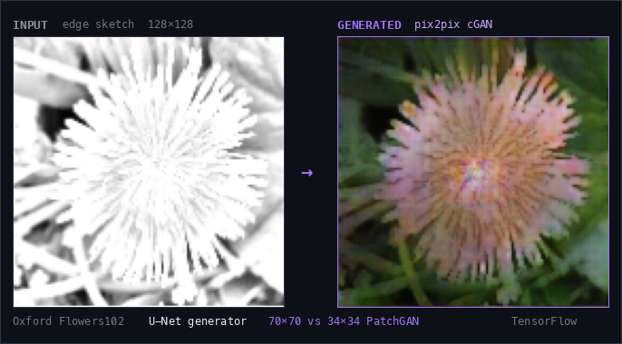

  

  <a href="https://github.com/morielturgeman/Upscale"><b>UPscale</b></a>
  &nbsp;·&nbsp;
  <a href="#featured-work">Featured Work</a>
  &nbsp;·&nbsp;
  <a href="#tech-stack">Stack</a>
  &nbsp;·&nbsp;
  <a href="#education">Education</a>
  &nbsp;·&nbsp;
  <a href="#contact">Contact</a>

---

## About

M.Sc. Computer Science student at **Ben-Gurion University of the Negev**, focused on
**Machine Learning**, **Deep Learning** and **Computer Vision**.

I build and train models, then turn them into working systems — end to end: data and
degradation modeling, architecture, training, evaluation, and deployment behind a real API.
Work spans computer vision, video restoration, generative models, LLM/RAG systems and
production AI pipelines.

---

## Featured Work

### UPscale — Deep Learning Video Restoration & 4× Super-Resolution

Recurrent video super-resolution built from the ground up in **PyTorch**: a BasicVSR-style
network with **SPyNet** optical-flow alignment and **bidirectional recurrent feature
propagation** over a **15-frame temporal window**, trained on **REDS** with synthetic
degradation modeling and fine-tuned on **H.264 codec-aware** degradations (V4) to close the
gap to real-world compressed footage.

  

<table>
  <tr>
    <th align="left">Model</th>
    <th align="center">PSNR</th>
    <th align="center">SSIM</th>
  </tr>
  <tr>
    <td align="left"><b>UPscale V4</b> — codec-aware fine-tune</td>
    <td align="center"><b>28.87 dB</b></td>
    <td align="center"><b>0.7986</b></td>
  </tr>
  <tr>
    <td align="left">Bicubic ×4 baseline</td>
    <td align="center">25.87 dB</td>
    <td align="center">0.6918</td>
  </tr>
  <tr>
    <td align="left">Improvement</td>
    <td align="center"><b>+3.00 dB</b></td>
    <td align="center"><b>+0.1068</b></td>
  </tr>
</table>

Evaluated on REDS4 over 430 evaluation windows. V3 → V4 codec fine-tuning adds +0.36 dB on compressed video.

**Stack** &nbsp;
`PyTorch` `BasicVSR` `SPyNet` `OpenCV` `FastAPI` `NumPy`

➜ &nbsp;**[View the repository](https://github.com/morielturgeman/Upscale)**

 

### Sketch-to-Image Translation

A **pix2pix conditional GAN** reproduction — **U-Net generator** + **PatchGAN discriminator** —
translating edge sketches to RGB images on Oxford Flowers102, with a controlled experiment on
the discriminator's receptive field: **70×70 vs 34×34 PatchGAN**, isolating how patch scale
trades off local texture sharpness against global coherence.

  

**Stack** &nbsp;
`TensorFlow` `Keras` `OpenCV` `pix2pix` `cGAN`

 

### LLM / RAG & Agentic Systems

Production-shaped AI systems beyond vision — retrieval pipelines and tool-using agents
served behind real APIs.

<table>
  <tr>
    <td valign="top" width="50%">
      <b>Retrieval</b> 
      Document chunking · embeddings · semantic search over <code>PostgreSQL</code> + <code>pgvector</code>
    </td>
    <td valign="top" width="50%">
      <b>Agents</b> 
      <code>LangGraph</code> state machines · tool calling · structured outputs
    </td>
  </tr>
  <tr>
    <td valign="top">
      <b>Serving</b> 
      <code>FastAPI</code> services · <code>Docker</code> · evaluation harnesses and regression tests
    </td>
    <td valign="top">
      <b>Applied</b> 
      Multi-source incident triage · correlation and clustering · structured reports
    </td>
  </tr>
</table>

➜ &nbsp;**[AI Security Investigator](https://github.com/morielturgeman/Ai-Security-Investigator)** — multi-source incident correlation and triage with structured LLM outputs and an evaluation harness.

---

## Tech Stack

<table>
  <tr>
    <td valign="top"><b>Deep Learning / ML</b></td>
    <td><code>PyTorch</code> <code>TensorFlow</code> <code>Keras</code> <code>scikit-learn</code> <code>NumPy</code> <code>OpenCV</code></td>
  </tr>
  <tr>
    <td valign="top"><b>AI Systems</b></td>
    <td><code>FastAPI</code> <code>LangGraph</code> <code>PostgreSQL</code> <code>pgvector</code> <code>Docker</code></td>
  </tr>
  <tr>
    <td valign="top"><b>Languages</b></td>
    <td><code>Python</code> <code>C++</code> <code>Java</code> <code>C</code> <code>SQL</code> <code>JavaScript</code> <code>TypeScript</code></td>
  </tr>
</table>

---

## Current Focus

`Deep Learning` &nbsp;`Computer Vision` &nbsp;`Video Restoration / Super-Resolution` &nbsp;`Generative Models` &nbsp;`LLM · RAG · Agentic Systems` &nbsp;`Production ML Engineering`

---

## Education

**M.Sc. Computer Science** — Ben-Gurion University of the Negev · 2026–2028

**B.Sc. Computer Science** — College of Management Academic Studies · 2023–2026 · GPA 92

Relevant coursework: Machine Learning · Deep Learning · Computer Vision

---

## Contact

[LinkedIn](https://www.linkedin.com/in/morielturgeman) &nbsp;·&nbsp; [GitHub](https://github.com/morielturgeman) &nbsp;·&nbsp; [Email](mailto:morieltorgeman@gmail.com)

<b>Build. Train. Evaluate. Ship.</b>
