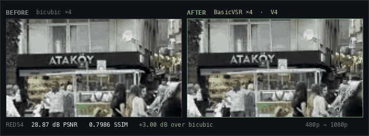

  

  <a href="https://github.com/morielturgeman/Upscale"><b>UPscale</b></a>
  &nbsp;·&nbsp;
  <a href="#featured-work">Featured Work</a>
  &nbsp;·&nbsp;
  <a href="#tech-stack">Stack</a>
  &nbsp;·&nbsp;
  <a href="#education">Education</a>
  &nbsp;·&nbsp;
  <a href="#contact">Contact</a>

---

## About

Computer Science **B.Sc. graduate** with a specialization in Deep Learning, and an
**M.Sc. in Computer Science student at Ben-Gurion University of the Negev**.

I work on **Agentic AI and LLM systems**, **Deep Learning** and **Computer Vision** — and I build
them as production systems. That means the whole path: data and degradation modeling, architecture
and training, evaluation harnesses, then serving it behind a real API with persistence, tool
calling and retrieval underneath.

## Featured Work

### UPscale — Deep Learning Video Restoration & 4× Super-Resolution

Recurrent video super-resolution built from the ground up in **PyTorch**: a BasicVSR-style
network with **SPyNet** optical-flow alignment and **bidirectional recurrent feature
propagation** over a **15-frame temporal window**, trained on **REDS** with synthetic
degradation modeling and fine-tuned on **H.264 codec-aware** degradations (V4) to close the
gap to real-world compressed footage.

  

  Real 256×144 input · real 1024×576 model output — <a href="https://github.com/morielturgeman/morielturgeman/raw/main/assets/upscale-demo.mp4">watch the full clip in HD</a>

  

Evaluated on REDS4 over 430 evaluation windows. V3 → V4 codec fine-tuning adds +0.36 dB on compressed video.

**Stack** &nbsp;
`PyTorch` `BasicVSR` `SPyNet` `OpenCV` `FastAPI` `NumPy`

➜ &nbsp;**[View the repository](https://github.com/morielturgeman/Upscale)**

 

### LLM / RAG & Agentic Systems

Production-shaped AI systems beyond vision — retrieval pipelines and tool-using agents
served behind real APIs.

<table>
  <tr>
    <td valign="top" width="50%">
      <b>Retrieval</b> 
      Document chunking · embeddings · semantic search over <code>PostgreSQL</code> + <code>pgvector</code>
    </td>
    <td valign="top" width="50%">
      <b>Agents</b> 
      <code>LangGraph</code> state machines · tool calling · structured outputs
    </td>
  </tr>
  <tr>
    <td valign="top">
      <b>Serving</b> 
      <code>FastAPI</code> services · <code>Docker</code> · evaluation harnesses and regression tests
    </td>
    <td valign="top">
      <b>Applied</b> 
      Multi-source incident triage · correlation and clustering · structured reports
    </td>
  </tr>
</table>

➜ &nbsp;**[AI Security Investigator](https://github.com/morielturgeman/Ai-Security-Investigator)** — multi-source incident correlation and triage with structured LLM outputs and an evaluation harness.

## Tech Stack

<table>
  <tr>
    <td valign="top"><b>ML / AI</b></td>
    <td><code>PyTorch</code> <code>TensorFlow</code> <code>OpenCV</code> <code>LangGraph</code> <code>LangChain</code> — CNNs, GANs, RAG, LLMs, Computer Vision, Image Signal Processing (ISP)</td>
  </tr>
  <tr>
    <td valign="top"><b>Algorithms</b></td>
    <td>Conventional image processing · algorithm design · research &amp; analysis</td>
  </tr>
  <tr>
    <td valign="top"><b>Web &amp; Full-Stack</b></td>
    <td><code>FastAPI</code> <code>Node.js</code> <code>React</code> <code>PostgreSQL</code> <code>pgvector</code> <code>MongoDB</code> <code>REST APIs</code></td>
  </tr>
  <tr>
    <td valign="top"><b>Languages</b></td>
    <td><code>Python</code> <code>Java</code> <code>C++</code> <code>C</code> <code>JavaScript</code> <code>TypeScript</code> <code>SQL</code> <code>HTML</code> <code>CSS</code></td>
  </tr>
  <tr>
    <td valign="top"><b>Tooling</b></td>
    <td><code>Git</code> <code>Docker</code> <code>MCP</code></td>
  </tr>
</table>

## Current Focus

`Deep Learning` &nbsp;`Computer Vision` &nbsp;`Video Restoration / Super-Resolution` &nbsp;`Generative Models` &nbsp;`LLM · RAG · Agentic Systems` &nbsp;`Production ML Engineering`

## Education

**M.Sc. Computer Science** — Ben-Gurion University of the Negev · in progress

**B.Sc. Computer Science** — College of Management Academic Studies · 2023–2026 · GPA 92

Specialization in Deep Learning · Relevant coursework: Machine Learning · Deep Learning · Computer Vision

Colman Dev Club — collaborative full-stack projects with React, Node.js, Express and Git.

## Contact

[LinkedIn](https://www.linkedin.com/in/morielturgeman) &nbsp;·&nbsp; [GitHub](https://github.com/morielturgeman) &nbsp;·&nbsp; [Email](mailto:morieltorgeman@gmail.com)

<b>Build. Train. Evaluate. Ship.</b>
